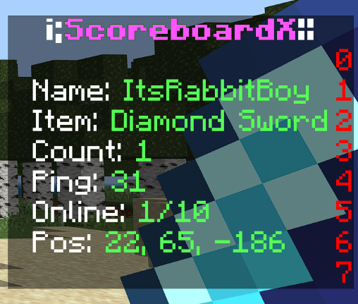

# Scoreboard-X

This is a scoreboard plugin for [BDSX](https://github.com/bdsx/bdsx). You can add or create addons for your scoreboard and you can customize your own scoreboard.



# Setup
## How to customize the scoreboard
- Go to the folder where your plugins is located.
- Find the scoreboard-x plugin folder and open.
- Open `config.json` in scoreboard-x plugin.
- Customize the scoreboard you want.

## How to create your addon
- Go to scoreboard-x plugin folder.
- Go to addons folder.
- Create a new typescript file`(example.ts)`.
- Copy this script and past to your addon file`(example.ts)`.
```ts
import { ServerPlayer } from "bdsx/bds/player";
import { AddonData } from "../src/addon";

export function getProcessedTags(player: ServerPlayer): AddonData[] {
    return [
      ["{ping!}", "Pong!"],
    ];
}
```
- And you can edit your scoreboard addon.

# Other
If you have ideas for future updates or you find bugs in this plugin you can report [here](https://github.com/ItzCandra23/scoreboard-x/issues/new).

## Author
- [Github](https://github.com/ItzCandra23)
- [OmletArcade](https://omlet.gg/profile/candra_gaming123)
- [Youtube](https://www.youtube.com/@itzcandra23)
